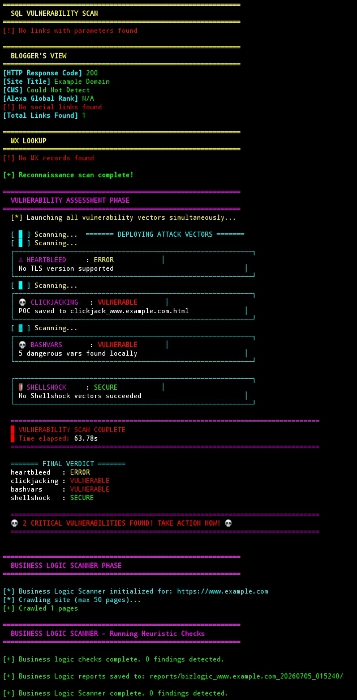

# ❤️‍🔥 Heartbleed Pro v1.0

<div align="center">
  
</div>

<!-- 🔴 LIVE HEADER ANIMATION (replace with GIF) -->
<div align="center">
  
</div>

**All-in-One Reconnaissance + Vulnerability Assessment + Business Logic Security Scanner**

[](https://www.python.org/)
[](LICENSE)
[](#)
[](#)

---

## 📊 Dashboard Overview

[✔] Target Analysis Engine      : ACTIVE [✔] Reconnaissance Module       : READY [✔] Vulnerability Scanner       : READY [✔] Business Logic Tester       : READY [✔] Reporting System            : ENABLED

---

## 📋 Features

### 🔍 Reconnaissance
- WHOIS + DNS Intelligence
- Subdomain Enumeration
- Port Scanning Integration
- CMS & Server Detection

### 💀 Vulnerability Scanner
- Clickjacking Detection
- Heartbleed (TLS Check)
- Shellshock Validation
- Header Security Audit

### 🛡️ Business Logic Testing
- IDOR & Access Control Testing
- Authentication Bypass Checks
- Weak Password Recovery Flow
- Rate Limit Analysis

---

<div align="center">
  
</div>

---

## 📦 Installation

```bash
sudo apt update
sudo apt install python3 python3-pip git -y

git clone https://github.com/sylhetyhackvenger/HeartBleed-Pro
cd HeartBleed-Pro

pip install -r requirements.txt

📌 Requirements

requests
beautifulsoup4
dnspython
python-whois
lxml
urllib3


---

🚀 Usage

python3 heartbleed_pro.py example.com
python3 heartbleed_pro.py 192.168.1.1


---

⚠️ Ethical Notice

This tool is strictly for authorized penetration testing only. Unauthorized scanning or exploitation is prohibited.


---

👨‍💻 Author

SYLHETYHACKVENGER (THE-ERROR808)


---
